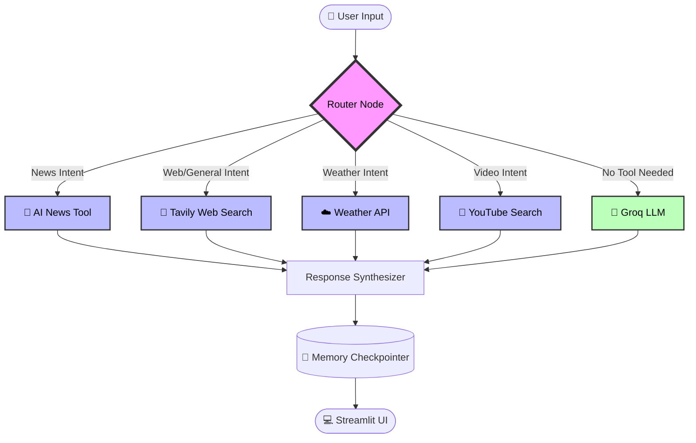
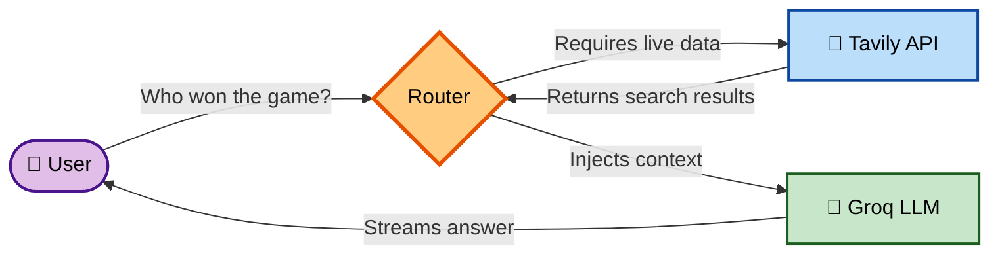
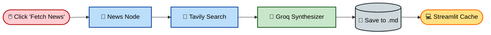
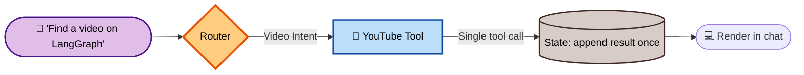

# 🤖 Graphite AI

<div align="center">

 
### *A multi-tool agent that reasons, routes, and remembers.*
 
[](https://python.org)
[](https://streamlit.io)
[](https://langchain.com)
[](https://groq.com)
[](https://opensource.org/licenses/MIT)
 
</div>
 
## ✨ Why Graphite AI?
 
Most LLM wrappers are stateless and boxed in by their training data. **Graphite AI** is different.
 
Built on **LangGraph**, it behaves as an intelligent router — evaluating every prompt before deciding how to answer it. Ask it a coding question, and it responds directly from the model. Ask it about current events, live weather, or a video tutorial, and it autonomously reaches out to the right tool, pulls real data, and folds that into its answer — no manual tool-picking required.
 
> 💡 **In short:** it's not a chatbot with a search button bolted on. Routing, tool use, and memory are native parts of how it thinks.
 
---
 
## 🚀 Core Capabilities
 
| Feature | Description |
| :--- | :--- |
| 🎥 **YouTube Search** | Finds and surfaces relevant video tutorials based on user intent |
| ☁️ **Weather Info** | Fetches real-time weather data for any global location |
| 📰 **AI News Aggregation** | Compiles and summarizes the latest AI industry updates into a cached, chronological report |
| 🔎 **Web Search** | Tavily-powered search augmentation for fast, accurate real-time answers |
| 🧠 **Dynamic Routing** | Evaluates prompts and routes them to the correct tool automatically |
| ⚡ **Real-Time Streaming** | Streams LLM responses token-by-token for a fast, responsive feel |
| 📊 **Agent Diagnostics** | An "Under the Hood" panel showing live Mermaid execution graphs + state JSON inspection |
 
---
 
## 🏗️ Architecture Flow
 
Graphite AI runs on a directed graph — every request moves through a router node that decides which tool (if any) gets called before the response is synthesized.
 

 
---
 
## 🔍 Deep Dive Workflows
 
### 🔎 Web Search Augmentation
 
When a prompt needs live knowledge the model wasn't trained on, the router silently calls Tavily, injects the result as context, and *then* generates the answer.
 

 
### 📰 AI News Explorer
 
A dedicated multi-step pipeline: search → summarize → cache → render, so repeated visits don't re-trigger the same API calls.
 

 
### 🎥 YouTube Tool Resolution
 

 
---

 
---
 
## 🛠️ Tech Stack
 
| Layer | Technology |
| :--- | :--- |
| Agent Orchestration | LangGraph, LangChain |
| LLM Engine | Groq (Llama 3) |
| Search Infrastructure | Tavily API |
| Frontend | Streamlit |
| Memory Persistence | LangGraph `MemorySaver` |
 
---
 
## ⚡ Quick Start
 
Get Graphite AI running locally in under 2 minutes.
 
**1. Clone the repository**
```bash
git clone https://github.com/amanshukla2004/Agentic_ChatBot.git
cd Agentic_ChatBot
```
 
**2. Install dependencies**
```bash
pip install -r requirements.txt
```
 
**3. Configure API keys**
 
Enter them in the Streamlit UI, or export them to skip the prompt:
```bash
export GROQ_API_KEY="your-groq-api-key"
export TAVILY_API_KEY="your-tavily-api-key"
```
 
**4. Launch the app**
```bash
streamlit run app.py
```
 
---
 
## 📁 Project Structure
 
```text
Agentic_ChatBot/
├── app.py                     # Streamlit entry point
├── requirements.txt           # Project dependencies
└── src/
    └── langgraph_agentic_ai/
        ├── graph/             # LangGraph nodes & state schema
        ├── tools/             # YouTube, Weather, and News integrations
        ├── LLMS/              # Groq model configurations
        └── ui/                # Streamlit UI & Visualizer components
```
 
---
 
## 🗺️ Roadmap
 
- [ ] Support for local, offline LLMs via Ollama
- [ ] Multi-agent workflows (dedicated Researcher + Writer agents)
- [ ] Expand tool registry with GitHub and Jira integrations
- [ ] Persistent auth + PostgreSQL for long-term memory
- [ ] LangSmith tracing integration
---
 
<div align="center">
**Built with ❤️ by Aman Shukla**
 
[LinkedIn](https://www.linkedin.com/in/amanshukla-dev/) • [Email](mailto:work.amanshukla2004@gmail.com)
 
</div>
