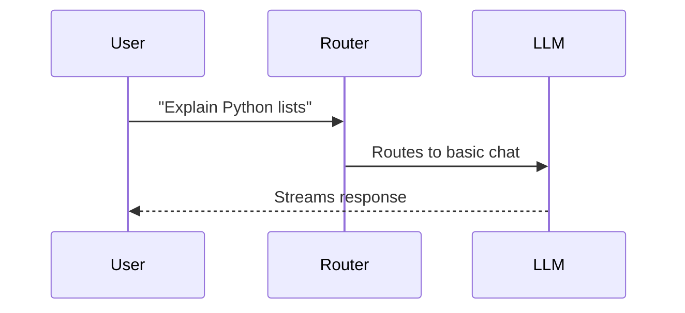
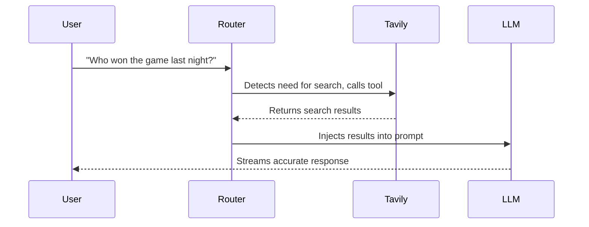
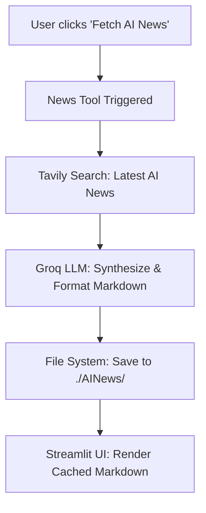

# 🤖 Graphite AI: Project Overview

Graphite AI is a powerful, multi-functional AI agent built on top of **LangGraph**, **Streamlit**, **Groq**, and **Tavily**. It is designed to act as an intelligent assistant capable of simple conversation, web-augmented research, and automated news summarization.

---

## 🛠️ Tech Stack & Architecture

- **LangGraph**: Used as the core orchestrator. It manages state transitions and graphs out the logic flow (e.g., fetching data -> summarizing data -> saving data).
- **Streamlit**: Provides a clean, responsive, and dynamic frontend user interface, including interactive agent diagnostic tabs.
- **Groq**: The LLM engine. It provides lightning-fast text generation and summarization capabilities.
- **Tavily API**: An AI-focused search engine used to fetch real-time data and news from the web.

---

## 🚀 Core Features & Functionality

### 1. Basic Chatbot
A standard, fast conversational interface. Users can chat directly with the Groq LLM without any external tool augmentations. Perfect for quick questions, brainstorming, or coding help.

### 2. Chatbot with Web Search
An advanced conversational agent that has access to the internet. 
- When a user asks a question that requires real-time knowledge (e.g., "What is the weather today?"), the agent seamlessly calls the Tavily API to search the web.
- It then synthesizes the search results and provides an accurate, up-to-date answer via character-by-character text streaming.

### 3. AI News Explorer
A highly specialized workflow designed to keep users updated on the latest Artificial Intelligence trends.
- **Dynamic Timeframes**: Users can select `Daily`, `Weekly`, or `Monthly` news updates.
- **Automated Research Pipeline**: Once triggered, LangGraph orchestrates a multi-step pipeline:
  1. **Fetch**: Queries Tavily for the latest top AI news globally.
  2. **Summarize**: Feeds the raw articles into the Groq LLM to generate a beautifully formatted chronological markdown report.
  3. **Save**: Automatically writes the generated report to a local markdown file (e.g., `./AINews/weekly_summary.md`).
- **Optimized UI Rendering**: The Streamlit frontend smartly caches the generated markdown files, meaning users can view the reports instantly without re-triggering expensive API calls.

### 4. Interactive Agent Diagnostics
A dedicated "Under the Hood" dashboard embedded in the sidebar allowing developers to inspect the agent's brain in real-time.
- **Graph View**: Real-time Mermaid visualizations of the active LangGraph execution.
- **State Inspector**: A live JSON viewer showing exactly what data is in the agent's memory.
- **Timeline**: A step-by-step breakdown of exactly which tools were called, how long they took, and what they returned.

---

## 🛡️ Robustness & Error Handling

- **API Key Management**: Securely handles API keys by allowing users to input them directly via the UI or `.env` files, preventing key hardcoding.
- **Timeout Protection**: Includes custom safeguards against third-party API outages (like timeouts from Tavily). If a service goes down, the app degrades gracefully, showing an error message on screen instead of crashing the server.
- **State Management**: Uses careful synchronization between LangGraph's global state and internal node states to prevent `KeyError` crashes. 

---

## ⚙️ Configuration

The UI is modular and driven by a `uiconfigfile.ini` configuration file. This allows developers to easily add new LLM providers, change model options, or add new use cases without having to rewrite the core Streamlit UI components.
